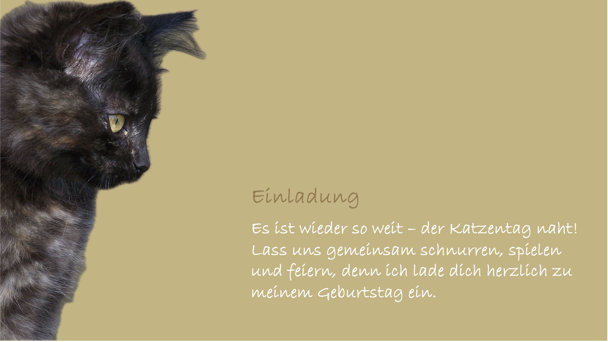

= Abschluss-Arbeitsblatt – Mehr aus Ihren Fotos machen

Dieses Arbeitsblatt dient zur Wiederholung der Themen aus dem Workshop.  
Ziel ist es, die gesamte Bildbearbeitungskette selbstständig zu üben:  
*Importieren → Speichern → Organisieren → Bearbeiten*.

== Aufgabe: Einladungskarte mit Foto erstellen

=== Vorbereitung
Laden Sie das Katzenbild `Bild-16` aus der xref:gallery.adoc[Fotogalerie] auf Ihren PC, indem Sie über
einen Rechtsklick auf das Bild zum Menu `Bild speichern unter...` navigieren und den Download auslösen.

Die Katze soll aus dem Bild extrahiert werden, um den Katzenkopf für folgende *Einladungskarte* verwenden zu können:

=== Windows
. Kopieren Sie das Katzenfoto in den Ordner `Bilder`.
. Starten Sie die App *Fotos*.
. Öffnen Sie das Katzenfoto im Bearbeitungsmodus → Button *Bearbeiten*.
. Schneiden Sie das Foto so zu, dass die Wand links verschwindet.
. Nutzen Sie dann den AI-Modus *Hintergrund*, um den Hintergrund zu entfernen.
. Warten Sie bis die AI den Hintergrund entfernt hat.
. Speichern Sie das bearbeitete, neue Katzenbild als Kopie unter dem Namen `Katze1` im Ordner `Bilder`.
. Nutzen Sie *Powerpoint von Microsoft*, um die Einladungskarte zu erstellen.

=== Mac
. Starten Sie die App *Fotos*.
. Kopieren Sie das Katzenbild mit Drag&Drop in die Mediathek.
. Klicken Sie mit der rechten Maustaste auf das Hauptmotiv, hier die Katze.
. Wählen Sie `Motiv teilen...` kopieren oder `Motiv kopieren` aus dem Kontextmenü. 
. MacOS isoliert automatisch das erkannte Motiv und kopiert es mit transparentem Hintergrund in die Zwischenablage.
. Das freigestellte Motiv kann anschliessend in Programmen wie Vorschau, Pages oder Mail mit Command+V eingefügt und als neues Katzenbild abgespeichert werden.
. Nutzen Sie *Keynote von Apple*, um die Einladungskarte zu erstellen.