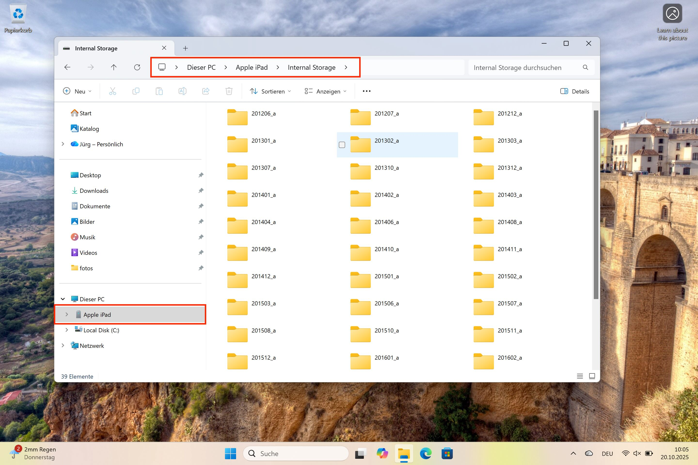
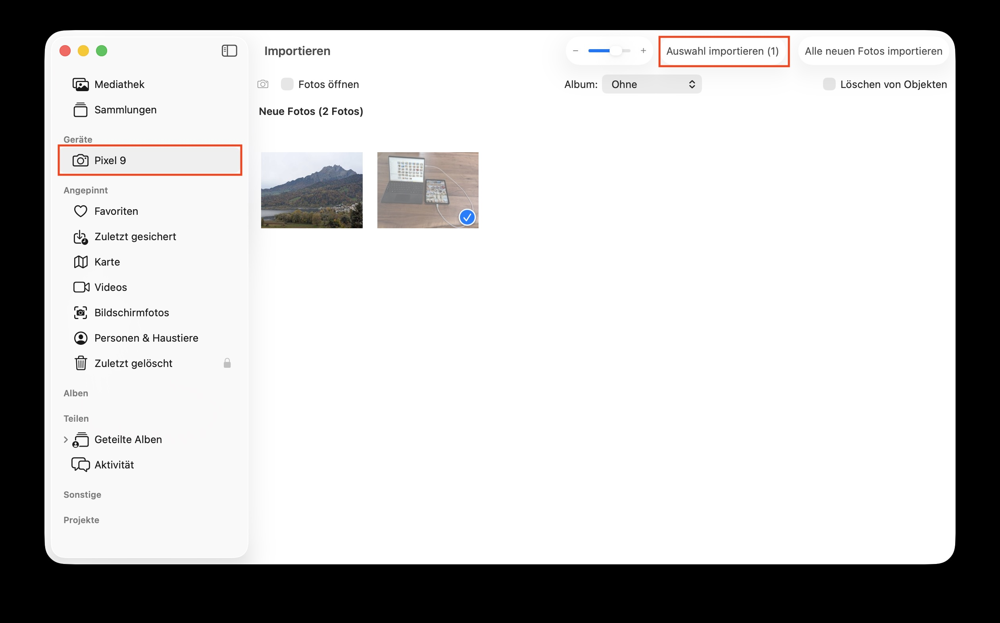

= Arbeitsblatt 1 

== Fotos über USB auf PC kopieren 

*Ziel:* Wissen, wie man Fotos vom Smartphone oder der Kamera auf den PC *kopiert*.

[IMPORTANT]
Bei Android müssen Sie sicherstellen, dass Ihr Gerät Dateien über USB-Verbindungen übertragen darf. 
Suchen Sie in den `Einstellungen` nach `USB`. iOS kontrolliert den Zugriff über die App *Fotos*.

[WARNING]
Wählen Sie *nicht* die Import-Funktion z.B. der App *Fotos*. *Bei vielen Fotos kann dieser Vorgang lange dauern,* da alle Fotos Ihres Gerätes auf den PC kopiert werden.

=== Windows
. Schliessen Sie das Smartphone oder die Kamera über ein USB-Kabel an den PC an.
. Öffnen Sie den *Explorer*.
. Wählen Sie das Gerät (z. B. Smartphone, Kamera).
- Öffnen Sie den internen Speicher des Gerätes. Siehe: +
     , 
. Markieren Sie die gewünschten Fotos → *kopieren* in einen Zielordner auf Ihrem Dateisystem.
. Die neuen Fotos finden Sie nun über den *Explorer* im Ihrem Zielordner.

[TIP]
Nutzen Sie die Shift- und Ctrl-Taste um mehrere Fotos für den Kopiervorgang zu selektieren.

=== Mac
. Schliessen Sie das Smartphone oder die Kamera über ein USB-Kabel an den PC an.
. Öffnen Sie die App *Fotos*.
. Wählen Sie in der Seitenleiste links das Gerät. Siehe +
    
. Markieren Sie die gewünschten Fotos → *Auswahl importieren*. Diese Aktion löst den Kopiervorgang aus.
. Die neuen Fotos finden Sie nun in der *Mediathek*.

[TIP]
Nutzen Sie die Command-Taste um einzelne Fotos für den Kopiervorgang zu selektieren.

== Fotos von der Cloud auf PC importieren 

*Ziel:* Wissen, wie man Fotos von der Cloud auf den PC *importiert*.

[IMPORTANT]
Stellen Sie sicher, dass Sie Ihr Benutzername und Passwort für Ihr Konto für den entsprechenden Cloud-Dienst zur Hand haben.

=== Windows
. Öffnen Sie mit einem Browser ihren Cloud-Dienst.
. Selektieren Sie die Fotos, die Sie auf Ihren PC herunterladen wollen.
. Über die Funktion `Herunterladen` - oft oben rechts über 3 Punkte zu finden - laden Sie die selektierten Fotos als zip-Datei auf Ihren PC.
. Entpacken Sie die zip-Datei, indem Sie auf die Datei doppelklicken. Die Fotos werden in einem neuen Ordner abgelegt. Der Ordner hat den gleichen Namen wie die zip-Datei.
. Geben Sie dem Ordner einen aussagekräftigen Namen und verschieben Sie an einen Ort, wo Sie alle anderen Fotos verwalten wollen.
. Öffnen Sie die App *Fotos* importieren.
. Erstellen Sie in der App einen neuen `Katalog`, indem Sie den neuen Ordner als Quelle angeben.

=== Mac
. Öffnen Sie mit einem Browser ihren Cloud-Dienst.
. Selektieren Sie die Fotos, die Sie auf Ihren PC herunterladen wollen.
. Über die Funktion `Herunterladen` - oft oben rechts über 3 Punkte zu finden - laden Sie die selektierten Fotos als zip-Datei auf Ihren PC.
. Entpacken Sie die zip-Datei, indem Sie auf die Datei doppelklicken. Die Fotos werden in einem neuen Ordner abgelegt. Der Ordner hat den gleichen Namen wie die zip-Datei.
. Nun können Sie die Fotos/Ordner in die App *Fotos* importieren.

== Typische Cloud Dienste für Fotos
. https://www.icloud.com/photos[iCloud Fotos]
. https://photos.google.com[Google Fotos]
