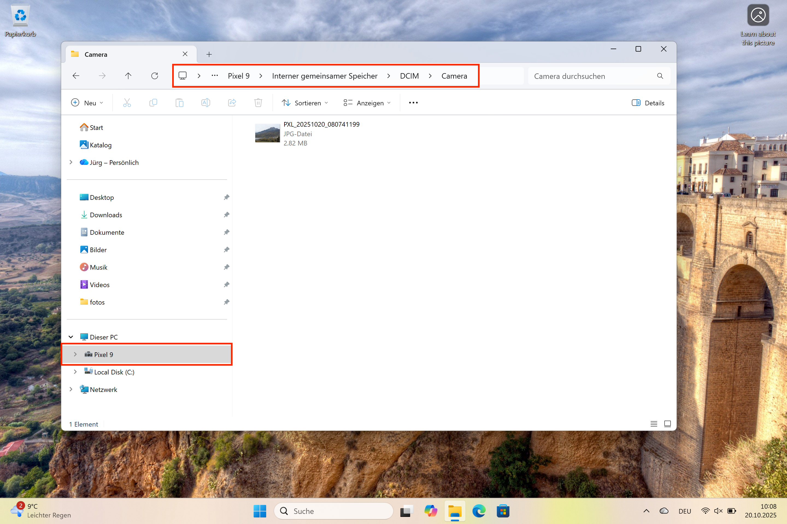

= Arbeitsblatt 1 

== Fotos über USB importieren 

*Ziel:* Fotos vom Smartphone oder der Kamera auf den Computer *kopieren*.

[IMPORTANT]
Stellen Sie sicher, dass Ihr Gerät Dateien über USB-Verbindungen übertragen darf. 
Suchen Sie in den `Einstellungen` nach `USB`. 

=== Windows
. Schliessen Sie das Smartphone oder die Kamera über ein USB-Kabel an den Computer an.
. Öffnen Sie den *Explorer*.
. Wählen Sie das Gerät (z. B. Smartphone, Kamera).
- Öffnen Sie den internen Speicher des Gerätes. Siehe: +
     , 
. Markieren Sie die gewünschten Fotos → *kopieren*.

[TIP]
Nutzen Sie die Shift- und Ctrl-Taste um mehrere Fotos für den Kopiervorgang zu selektieren.

=== Mac
. Schliessen Sie das Smartphone oder die Kamera über ein USB-Kabel an den Computer an.
. Öffnen Sie den *Finder*.
. Wählen Sie in der Seitenleiste links das Gerät.
. Markieren Sie Fotos → *Für Mediathek kopieren*.

== Fotos von der Cloud importieren 

*Ziel:* Fotos von der Cloud auf den Computer übertragen.

[IMPORTANT]
Stellen Sie sicher, dass Sie Ihr Benutzername und Passwort für Ihr Konto für den entsprechenden Cloud-Dienst zur Hand haben.

=== Windows
. Öffnen Sie mit einem Browser ihren Cloud-Dienst.
. Selektieren Sie die Fotos, die Sie auf Ihren Computer herunterladen wollen.
. Über die Funktion `Herunterladen` - oft oben rechts über 3 Punkte zu finden - laden Sie die selektierten Fotos als zip-Datei auf Ihren Computer.
. Entpacken Sie die zip-Datei, indem Sie auf die Datei doppelklicken. Die Fotos werden in einem neuen Ordner abgelegt. Der Ordner hat den gleichen Namen wie die zip-Datei.
. Geben Sie dem Ordner einen aussagekräftigen Namen und verschieben Sie an einen Ort, wo Sie alle anderen Fotos verwalten wollen.
. Öffnen Sie die App *Fotos* importieren.
. Erstellen Sie in der App einen neuen `Katalog`, indem Sie den neuen Ordner als Quelle angeben.

=== Mac
. Öffnen Sie mit einem Browser ihren Cloud-Dienst.
. Selektieren Sie die Fotos, die Sie auf Ihren Computer herunterladen wollen.
. Über die Funktion `Herunterladen` - oft oben rechts über 3 Punkte zu finden - laden Sie die selektierten Fotos als zip-Datei auf Ihren Computer.
. Entpacken Sie die zip-Datei, indem Sie auf die Datei doppelklicken. Die Fotos werden in einem neuen Ordner abgelegt. Der Ordner hat den gleichen Namen wie die zip-Datei.
. Nun können Sie die Fotos/Ordner in die App *Fotos* importieren.

== Typische Cloud Dienste für Fotos
. https://www.icloud.com/photos[iCloud Fotos]
. https://photos.google.com[Google Fotos]
