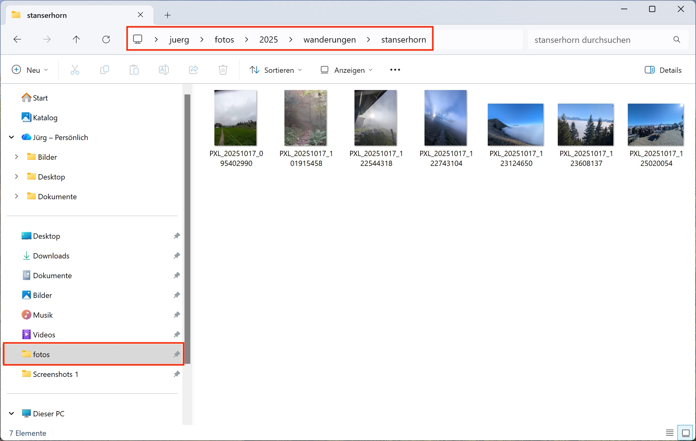

= Arbeitsblatt 2 – Fotos organisieren

*Ziel:* Übersicht in der Fotosammlung behalten.

== Windows
. Organisieren Sie Ihre Fotos mit Hilfe des Explorer.
. Erstellen Sie eine Ordner-Hierarchie auf dem Dateisystem. Als Übung im Ordner `2025` unter `wanderungen` einen neuen Ordner und benennen Sie ihn z. B. `stanserhorn`. Siehe: +
    
. Kopieren Sie ein paar Fotos in diesen Ordner.
. Öffnen Sie die App *Fotos*.
. Erstellen Sie in der App einen neuen `Katalog`, indem Sie den neuen Ordner `stanserhorn` als Quelle angeben.

[IMPORTANT]
Unter Windows wird die Fotosammlung im *Explorer* ausschliesslich über das Dateisystem organisiert. Die App *Fotos* dient als Anwendung zum *Anzeigen, Sortieren und Bearbeiten von Bildern und Videos* auf dem Computer. Sie hilft auch, Fotos automatisch nach Datum, Ort oder Alben zu sortieren. Auch die Integration in OneDrive und iCloud ermöglicht das zentrale Verwalten von Medien aus verschiedenen Quellen.

== Mac
. Organisieren Sie Ihre Fotos mit Hilfe der App *Fotos*.
. Öffnen Sie *Fotos* → Seitenleiste *Alben* → *+ Neues Album*.
. Geben Sie dem Album einen aussagekräftigen Namen ein.
. Ziehen Sie die passenden Fotos per Drag & Drop in das Album hinein.

[IMPORTANT]
Die App *Fotos* kann zum *Anzeigen, Verwalten und Bearbeiten von Bildern und Videos* auf dem Computer verwendet werden. 
